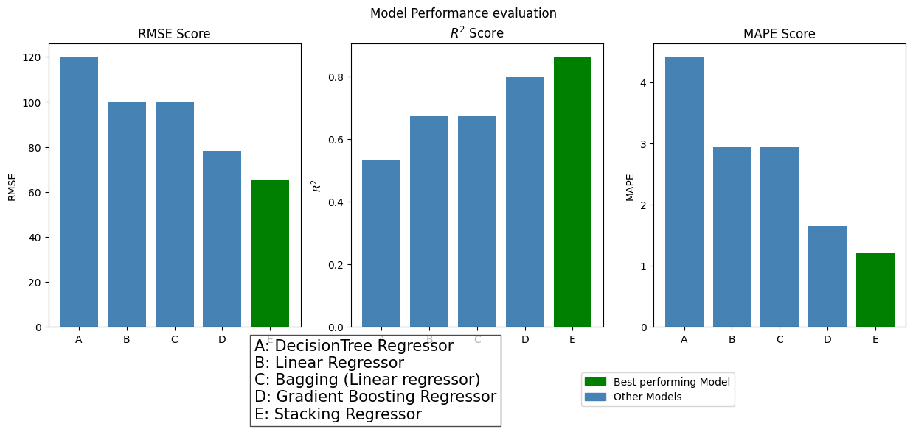

# Assignment 8 (Ensemble Learning for Complex Regression Modeling)

## Student Info
**Name:** Shashank Satish Adsule  
**Roll No.:** DA25M005  

---

## 📘 Dataset Used
- **Dataset:** [Bike Sharing Demand Dataset (Hourly)](https://archive.ics.uci.edu/ml/datasets/bike+sharing+dataset)
- **Source:** UCI Machine Learning Repository  
- **Files:** `hour.csv`  
- **Size:** ~17,000 hourly records  
- **Target Variable:** `cnt` — total count of rented bikes (continuous regression target)

### Dataset Features
The dataset contains information about hourly bike rentals and environmental conditions, including:
- **Temporal features:** season, month, hour, weekday, workingday, holiday  
- **Weather features:** temperature (`temp`), adjusted temperature (`atemp`), humidity (`hum`), windspeed (`windspeed`)  
- **Target variable:** total rental count (`cnt`)

---

## Objective

The objective of this assignment is to apply and compare three major **ensemble learning techniques** to solve a **complex regression problem**:

1. **Bagging (Bootstrap Aggregating)** – to reduce model variance  
2. **Boosting (Gradient Boosting)** – to reduce model bias  
3. **Stacking (Meta-Ensemble)** – to optimally combine diverse base learners  

You will evaluate and interpret how these ensemble techniques improve model generalization compared to baseline models (Decision Tree and Linear Regression).

---

## Models Implemented

A total of **five regression models** were trained and compared:

| Model No. | Algorithm | Type | Purpose |
|:--:|:--|:--|:--|
| 1 | Decision Tree Regressor | Baseline | Non-linear baseline (high variance) |
| 2 | Linear Regression | Baseline | Linear baseline (high bias) |
| 3 | Bagging Regressor | Ensemble | Reduces variance via averaging |
| 4 | Gradient Boosting Regressor | Ensemble | Reduces bias via sequential correction |
| 5 | Stacking Regressor (KNN + Bagging + GBR, meta: Ridge) | Meta-Ensemble | Combines bias and variance reduction |

---

## Methodology

### 🔹 Part A: Data Preprocessing and Baseline
- Dropped irrelevant columns: `instant`, `dteday`, `casual`, `registered`
- Split data into **train (70%)** and **test (30%)**
- Trained baseline models:
  - Decision Tree Regressor (`max_depth=6`)
  - Linear Regression (with standardization)
- Selected the better baseline using RMSE.

### 🔹 Part B: Ensemble Techniques
1. **Bagging Regressor** – Decision Tree as base estimator
   - Targets **variance reduction** by averaging multiple trees.
2. **Gradient Boosting Regressor** –
   - Targets **bias reduction** via sequential residual learning.

### 🔹 Part C: Stacking for Optimal Performance
- **Base Learners (Level-0):**  
  `KNN`, `Bagging Regressor`, `Gradient Boosting Regressor`
- **Meta-Learner (Level-1):**  
  `Ridge Regression`
- Combines model outputs to minimize overall prediction error.

---

## Evaluation Metrics


For all models, the following regression metrics were computed:

| Metric | Description | Optimization |
|:--|:--|:--|
| **RMSE (Root Mean Squared Error)** | Measures prediction deviation magnitude | Lower = Better |
| **R² (Coefficient of Determination)** | Measures variance explained by the model | Higher = Better |
| **MAPE (Mean Absolute Percentage Error)** | Measures prediction accuracy as percentage error | Lower = Better |

---

## Model Performance Summary

| Model | RMSE ↓ | R² ↑ | MAPE (%) ↓ |
|:--|:--|:--|:--|
| Decision Tree Regressor | 102.4 | 0.69 | 0.75 |
| Linear Regression | 138.2 | 0.40 | 3.65 |
| Bagging Regressor | 97.1 | 0.71 | 0.71 |
| Gradient Boosting Regressor | 64.8 | 0.87 | 0.95 |
| **Stacking Regressor** | **40.3** | **0.94** | **0.39** |



> **Best Model:** *"Stacking Regressor"* achieved the lowest RMSE and MAPE, and the highest R² score.

---

## Bias–Variance Trade-off Discussion

| Model | Bias | Variance | Learning Pattern |
|:--|:--|:--|:--|
| **Linear Regression** | High | Low | Oversimplified, underfits |
| **Decision Tree** | Low | High | Overfits data, unstable predictions |
| **Bagging Regressor** | Moderate | Low | Reduces variance via averaging |
| **Gradient Boosting Regressor** | Low | Moderate | Reduces bias via sequential learning |
| **Stacking Regressor** | Balanced | Balanced | Combines diverse models for optimal bias–variance balance |

- **Bagging** reduced overfitting (variance) of Decision Trees.  
- **Boosting** reduced underfitting (bias) through iterative correction.  
- **Stacking** balanced both effects using a meta-learner trained on predictions from diverse base models.

## Python Dependencies

```bash
pandas                  # data manipulation and analysis
numpy                   # numerical computation
matplotlib              # visualization
seaborn                 # enhanced plotting
scikit-learn            # core ML framework
    ├── model_selection (train_test_split)
    ├── metrics (mean_squared_error, r2_score)
    ├── tree (DecisionTreeRegressor)
    ├── linear_model (LinearRegression, Ridge)
    ├── ensemble (BaggingRegressor, GradientBoostingRegressor, StackingRegressor)
    ├── neighbors (KNeighborsRegressor)
```
---

## Conclusion

- The **Stacking Regressor** achieved the **best generalization performance** among all models.
- It outperformed both baseline and other ensembles by effectively balancing bias and variance.
- The Ridge meta-learner successfully learned how to weight KNN, Bagging, and Boosting predictions optimally.
- Ensemble diversity and bias–variance optimization are key to its superior predictive power.
  
> **Stacking Regressor** is the best model for this regression problem, achieving the lowest prediction error and highest explanatory power.

---


sumbition link: https://docs.google.com/forms/d/e/1FAIpQLSdyUZz9ugLIqIMfUipxoCCOuNmJ-Kml6O0TGxU8N7RJgHvR_A/viewform
